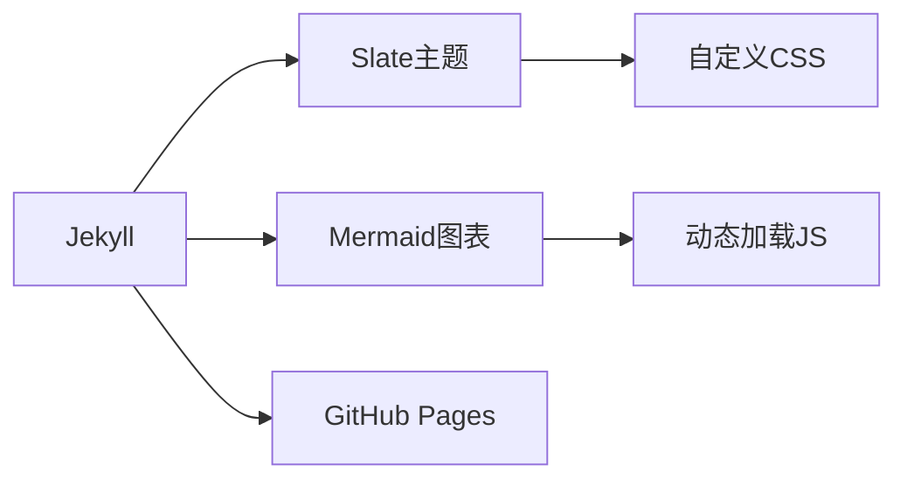

# 大模型工程师成长中心


**面向大模型训练系统开发者的沉浸式学习平台**，整合学习计划、论文追踪、实验分析等功能。

## 🚀 核心功能
- 📅 智能学习日历（支持iCalendar标准）
- 📊 实时进度看板（自动生成Mermaid图表）
- 🔬 实验报告模板（Python类自动跟踪训练指标）
- 📚 论文知识库（GitHub Flavored Markdown表格）

## 🛠️ 技术栈


## 📂 项目结构
```bash
.
├── _config.yml        # Jekyll配置
├── index.md           # 主界面
├── paper-tracking.md  # 论文追踪系统
├── experiment-records.md # 实验记录
├── assets/            # 静态资源
│   ├── css/custom.css # 进度条样式
│   └── js/mermaid-loader.js # 图表加载
└── schedule.ics       # 学习日历文件
```

## ⚡ 快速部署
1. 克隆仓库：
```bash
git clone https://github.com/yourname/yourname.github.io
```
2. 安装依赖：
```bash
bundle install
```
3. 本地预览：
```bash
bundle exec jekyll serve
```
4. 访问 `http://localhost:4000`

## 📈 数据看板示例
```python
class TrainingMonitor:
    def __init__(self):
        self.metrics = {
            'gpu_util': [],
            'memory_usage': []
        }
        
    def record(self, util, mem):
        self.metrics['gpu_util'].append(util)
        self.metrics['memory_usage'].append(mem)
        
    def visualize(self):
        import matplotlib.pyplot as plt
        plt.plot(self.metrics['gpu_util'], label='GPU利用率')
        plt.plot(self.metrics['memory_usage'], label='显存占用')
```

## 📝 使用指南
| 功能模块       | 操作说明                          |
|----------------|----------------------------------|
| 日历同步       | 点击首页"下载日历"按钮导入到设备  |
| 论文状态更新   | 编辑paper-tracking.md文件表格     |
| 实验数据录入   | 使用Python类自动记录训练指标      |
| 性能图表生成   | 浏览器自动渲染Mermaid流程图        |

## 📜 开源协议
[MIT License](LICENSE) © 2025 [律言]
