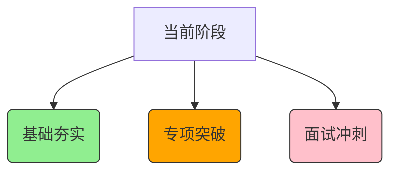

  <h1>大模型工程师90天冲刺计划</h1>
  

    

      
论文精读 65%

    

    

      
代码实践 40%

    

  

## 核心模块

  

    <h2>📅 学习日程</h2>
    
每日计划与周任务安排

    <a href="schedule.ics" download>下载日历文件</a>
  

  

    <h2>📚 论文追踪</h2>
    
20篇核心论文进度表

    <a href="/paper-tracking">查看详情 →</a>
  

  

    <h2>🔬 实验记录</h2>
    
分布式训练性能分析

    <a href="/experiment-records">查看报告 →</a>
  

