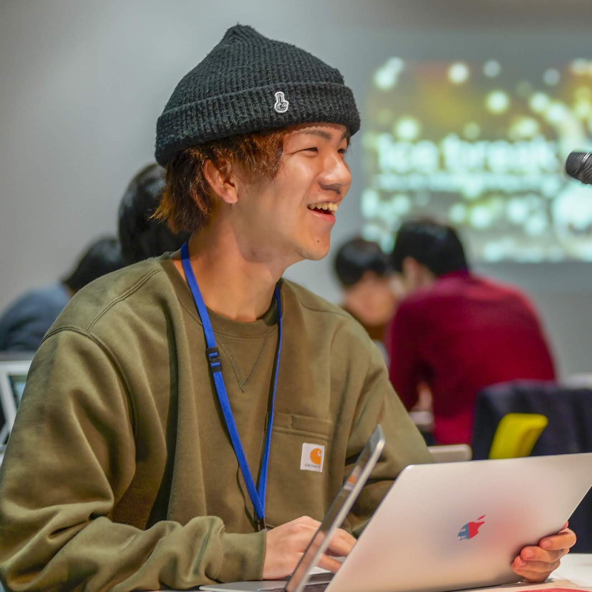

# サービス

Sandbar合同会社は、検索技術とChatGPTを駆使した機能開発とPoC（Proof of Concept）を提供する会社です。

あくまで一例ですが以下のユーザー行動においては、実線の矢印部分をサポートします。

| 段階                     | サービス例                                                                                                                                                                                                                                                                                              |
| :----------------------- | :------------------------------------------------------------------------------------------------------------------------------------------------------------------------------------------------------------------------------------------------------------------------------------------------------ |
| Organic Search → Visit   | 当社は検索技術を駆使し、Google検索でよりインデックスされ、上位にランキングされるような質の高いページを生成します。これにより、より多くのユーザーがサイトを訪れることができ、オーガニックな流入を増やすことが可能です。                                                                                  |
| Visit → Search,Recommend | 当社は検索技術を用いて、より優れたユーザーインターフェースを提供します。ユーザーがサイト内での検索を行った際に、高度な検索機能やパーソナライズされた検索結果を提供することで、ユーザーエクスペリエンスを向上させます。また、検索技術のPoCも行い、新たな機能やアルゴリズムの導入による改善を追求します。 |
| Search → Conversion      | 当社は検索システムの改善を行います。ユーザーが検索を行い、サイト内のコンテンツにアクセスした後、より効果的なコンバージョンを促すための施策を提案します。検索結果ページの最適化や検索体験の改善により、ユーザーが求める情報を効率的に見つけ、目的の行動に結び付けるお手伝いをいたします。                |  |

# メンバー

**安達光太郎**

2018年京都大学情報学科計算機科学コース卒業。2020年京都大学大学院情報学研究科社会情報学専攻卒業。同年、株式会社リクルートに入社し、サーバーサイドエンジニアとして開発に参画。検索改善案件などに携わり、検索エンジンに関する知識と経験を積んできました。検索エンジンについてのテーマで[Go Conference 2020 Spring 登壇](https://speakerdeck.com/kotaroooo0/jian-suo-enzinzi-zuo-ru-men-go-conference-2021-spring)や[WEB+DB PRESS Vol.126 寄稿](https://gihyo.jp/magazine/wdpress/archive/2022/vol126)。

<a href="https://twitter.com/kotaroooo0"><i class="fa-brands fa-square-twitter fa-lg"></i></a>
<a href="https://kotaroooo0-dev.hatenablog.com/archive"><i class="fa-solid fa-blog fa-lg"></i></a>

# 会社概要

| 正式名称　| Sandbar合同会社  |
| 代表者 | 安達光太郎  |
| 事業内容　| コンピュータシステムの企画、開発、販売及び保守に関する業務   |
| 資本金    | XXXX  |
| 設立年月日    | XXXX  |

# お問合せ

以下のいずれかからお気軽にお問合せください。

- Twitter @kotaroooo0
- Mail Address
- Google Form

