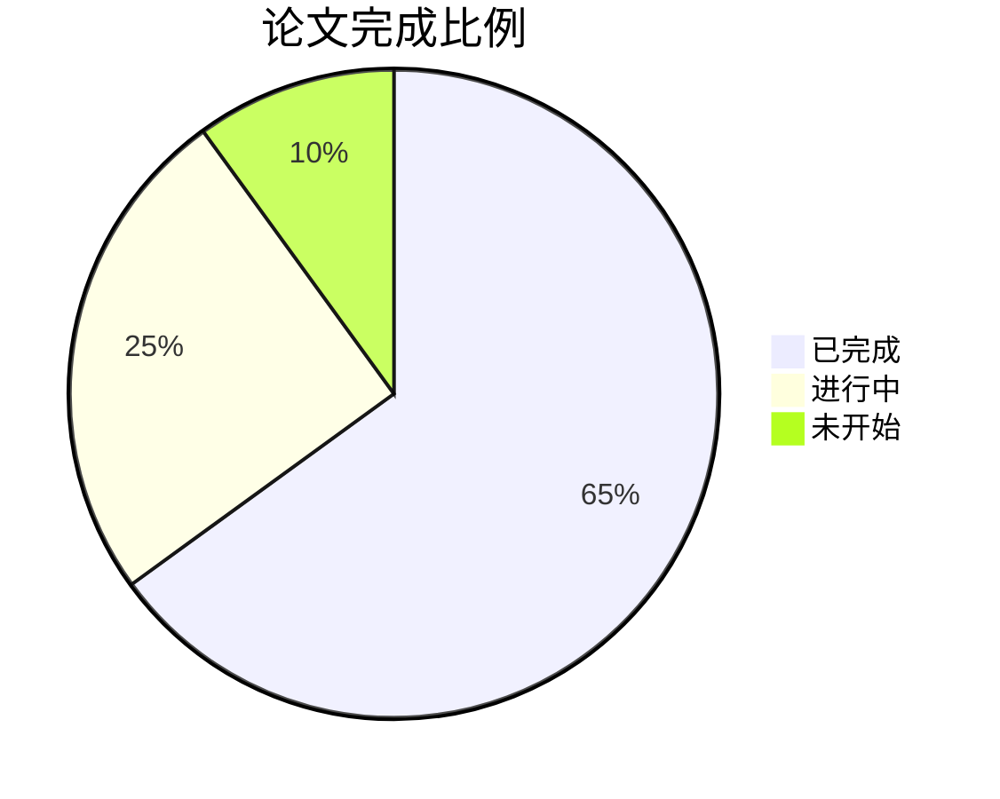

## 核心论文进度表
| 状态 | 论文名称 | 重点领域 | 最后更新 |
|------|---------|----------|---------|
| ✅   | ZeRO    | 内存优化 | 2025-03-05 |
| 🚧   | RetNet  | 架构创新 | 2025-03-12 |

```mermaid
pie
  title 论文完成比例
  "已完成" : 65
  "进行中" : 25
  "未开始" : 10
```
